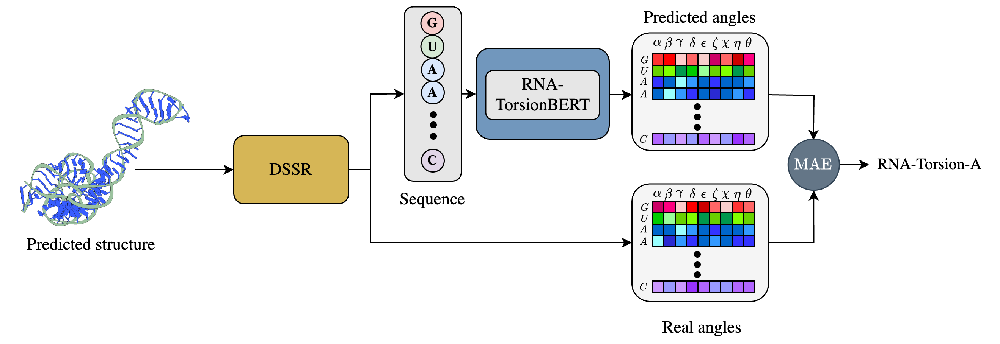
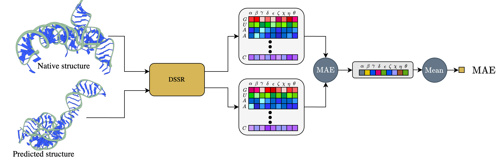

# RNA-Torsion-A

`RNA-Torsion-A` (for RNA torsional assessment) is a scoring function for RNA 3D structure based on RNA-TorsionBERT. 




## Installation 

To install RNA-Torsion-A and it's dependencies following commands can be used in terminal:

You need to first install [DSSR](https://github.com/EvryRNA/rna_angles_prediction_dssr) (a fork of DSSR with a python wrapper on top of it)
```bash
make install_dssr
```

Then you can install the python requirements:
```bash
pip install -r requirements.txt
```

You can also install it using `Docker`:
```bash
docker build -t rna_torsion_a . 
docker run --rm -it rna_torsion_a
```

## Usage

To run the RNA-Torsion-A, you can use the following command line:
```bash
python -m src.rna_torsion_cli [--in_pdb] [--out_path]
```

with:

- `--in_pdb`: Path to the input PDB file.
- `--out_path`: Path to a `.json` file where the output will be saved.


### MAE as metric

We also provide the computation of the MAE (mean average error) metric.



There is also a CLI to compute the `MAE` metric:

```bash
python -m src.mae_metric_cli [--pred_path] [--native_path] [--out_path]
```

with:

- `--pred_path`: Path to a `.pdb` file of a prediction or folder containing multiple `.pdb` files.
- `--native_path`: Path to the `.pdb` native file.
- `--out_path`: Path to a `.csv` file where the output will be saved.

## Examples

There are examples provided in the Makefile. 

```Makefile
run:
	python -m src.rna_torsion_a_cli --in_pdb=data/preds/3drna_rp11.pdb --out_path=data/out.csv
run_all:
	python -m src.rna_torsion_a_cli --in_pdb=data/preds --out_path=data/out.csv
run_mae:
	python -m src.mae_metric_cli --pred_path=data/preds --native_path=data/rp11.pdb --out_path=data/out_mae.csv
```

## Citation